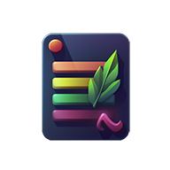

# Todolist-Party
This is a Todolist made with React.

Todolist Party est une application de gestion de tâches construite avec React. Elle vous permet de créer, organiser et suivre vos listes de tâches de manière simple et intuitive.

## Fonctionnalités

- Créez des listes de tâches personnalisées. (10 listes de tâches maximum)
- Ajoutez des tâches avec une description (40 caractères max)
- Marquez les tâches comme terminées ou en cours.
- Possibilité de choisir la couleur d'une liste  ( ⚫🔵🟢🔴🟣)
- Interface utilisateur réactive et conviviale  : Sur Tablette ou PC, les todolists peuvent être déplacées.

## Technologies utilisées

- Zustand : State management
- Tailwind CSS pour la mise en forme
- Material UI (notamment pour les pop up)
- Framer-motion : Pour rendre les éléments déplacables
- Sauvegarde des todolists en Localstorage
- midjourney pour la création du logo
- gh-pages : déploiement

## Wireframes Mobiles

J'espère que vous trouverez la Todolist Party utile pour gérer vos tâches quotidiennes.

N'hésitez pas à me contacter si vous avez des questions ou des commentaires. Happy tasking!
